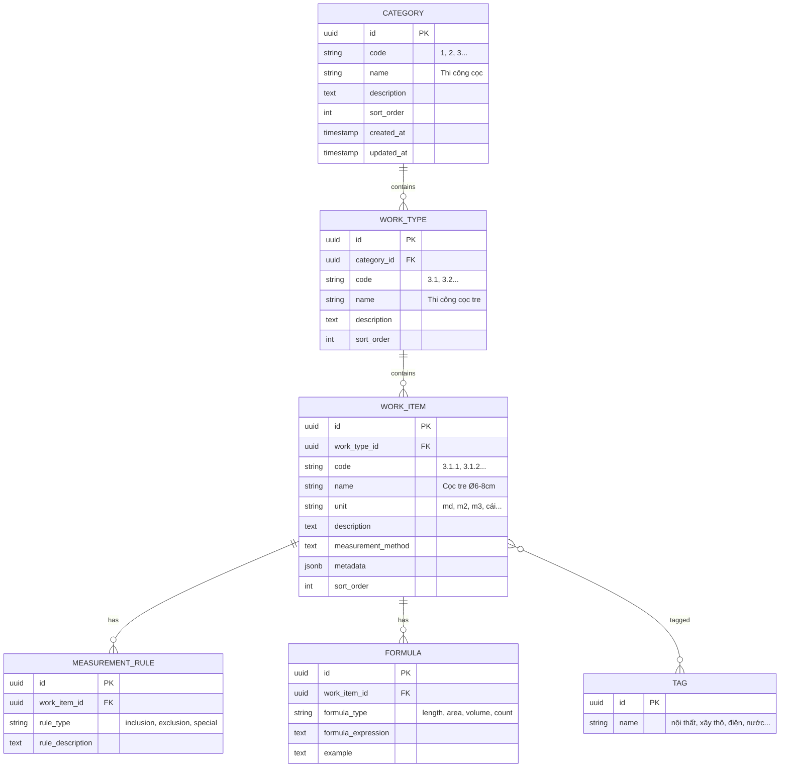
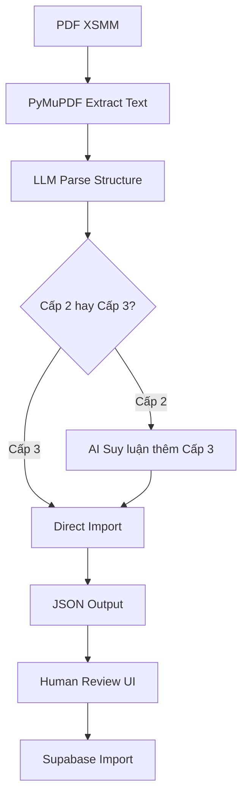

# XSMM Data Foundation - Design Document

> **For Claude:** REQUIRED SUB-SKILL: Use antigravity:executing-plans to implement this plan task-by-task.

**Goal:** Chuyển đổi tài liệu XSMM (PDF) thành cơ sở dữ liệu có cấu trúc, chuẩn hóa phương pháp bóc khối lượng cho Xhome SG.

**Architecture:** PostgreSQL on NAS (Synology Docker) làm database chính, JSON export cho AI RAG. Cấu trúc phân cấp 3 level với AI-assisted extraction từ PDF.

**Tech Stack:** Python, PostgreSQL (Docker), SQLAlchemy, PDF parsing (PyMuPDF/pdfplumber), LangChain

---

## Scope Clarification

> [!IMPORTANT]
> **XSMM chỉ focus vào CHUẨN HÓA BÓC KHỐI LƯỢNG.**
> 
> Đơn giá (Chi phí VL, NC, Máy, % Quản lý, % Lợi nhuận) sẽ là ứng dụng RIÊNG sau này, link với XSMM qua `work_item_code`.

---

## Database Schema

### Entity Relationship



### Table Details

#### 1. `categories` - Cấp 1

| Column | Type | Description |
|--------|------|-------------|
| `id` | UUID | Primary key |
| `code` | VARCHAR(10) | Mã phân loại (1, 2, 3...) |
| `name` | VARCHAR(255) | Tên category |
| `description` | TEXT | Mô tả |
| `sort_order` | INT | Thứ tự sắp xếp |

**Ví dụ:**
| code | name |
|------|------|
| 1 | Công tác chuẩn bị |
| 2 | Công tác đất |
| 3 | Thi công cọc |

---

#### 2. `work_types` - Cấp 2

| Column | Type | Description |
|--------|------|-------------|
| `id` | UUID | Primary key |
| `category_id` | UUID | FK → categories |
| `code` | VARCHAR(20) | Mã (3.1, 3.2...) |
| `name` | VARCHAR(255) | Tên loại công việc |
| `description` | TEXT | Mô tả chi tiết |

**Ví dụ:**
| code | name | category |
|------|------|----------|
| 3.1 | Thi công cọc tre | Thi công cọc |
| 3.2 | Thi công cọc cừ tràm | Thi công cọc |
| 3.3 | Thi công cọc BTCT | Thi công cọc |

---

#### 3. `work_items` - Cấp 3 (Chi tiết nhất)

| Column | Type | Description |
|--------|------|-------------|
| `id` | UUID | Primary key |
| `work_type_id` | UUID | FK → work_types |
| `code` | VARCHAR(30) | Mã (3.1.1, 3.1.2...) |
| `name` | VARCHAR(255) | Tên công việc cụ thể |
| `unit` | VARCHAR(20) | Đơn vị tính |
| `description` | TEXT | Mô tả chi tiết |
| `measurement_method` | TEXT | Cách thức đo lường |
| `metadata` | JSONB | Dữ liệu bổ sung |

**Ví dụ (AI sẽ suy luận thêm):**
| code | name | unit | measurement_method |
|------|------|------|-------------------|
| 3.1.1 | Cọc tre Ø6-8cm, L=2.5m | md | Tổng chiều dài cọc đã đóng |
| 3.1.2 | Cọc tre Ø8-10cm, L=3.0m | md | Tổng chiều dài cọc đã đóng |
| 3.3.1 | Cọc BTCT 200x200mm | md | Tổng chiều dài cọc đã ép |
| 3.3.2 | Cọc BTCT 250x250mm | md | Tổng chiều dài cọc đã ép |

---

#### 4. `measurement_rules` - Quy tắc đo

| Column | Type | Description |
|--------|------|-------------|
| `rule_type` | ENUM | `inclusion` / `exclusion` / `special` |
| `rule_description` | TEXT | Mô tả quy tắc |

**Ví dụ:**
- **inclusion**: "Bao gồm phần cọc đóng chìm dưới mặt đất"
- **exclusion**: "Không tính phần cọc bị gãy phải thay"
- **special**: "Nếu đóng xuyên qua lớp đất cứng, tính hệ số 1.2"

---

#### 5. `formulas` - Công thức tính

| Column | Type | Description |
|--------|------|-------------|
| `formula_type` | ENUM | `length` / `area` / `volume` / `count` |
| `formula_expression` | TEXT | Công thức |
| `example` | TEXT | Ví dụ minh họa |

**Ví dụ:**
```
formula_type: "length"
formula_expression: "Số cọc × Chiều dài mỗi cọc"
example: "100 cọc × 3m = 300 md"
```

---

## AI Extraction Pipeline



### AI Reasoning Rules (Suy luận Cấp 3)

Khi PDF chỉ có đến Cấp 2, AI sẽ suy luận Cấp 3 dựa trên:

1. **Kích thước/Quy cách**: Ø6-8cm, Ø8-10cm, 200x200mm...
2. **Chiều dài tiêu chuẩn**: L=2.5m, L=3.0m...
3. **Vật liệu cụ thể**: Tre, Tràm, BTCT M200, M300...
4. **Domain knowledge**: Tiêu chuẩn xây dựng Việt Nam

---

## Verification Plan

### Automated Tests

1. **Schema Validation**
```bash
# Chạy migration và kiểm tra schema
cd D:\AGENT PROJECTS\XSMM
python -m pytest tests/test_schema.py -v
```

2. **PDF Extraction Test**
```bash
# Test parse PDF sample
python -m pytest tests/test_pdf_parser.py -v
```

### Manual Verification

1. **Human Review UI**: QS team review dữ liệu extracted, đánh dấu sai/thiếu
2. **Sample Query**: Thử query vài work_items, kiểm tra đúng hierarchy

---

## Implementation Phases

### Phase 1: Schema & Data Extraction ✅ COMPLETED
- [x] Design schema (3-tier: Category → Work Type → Work Item)
- [x] Generate 23 categories, 106 work types, 351 work items
- [x] Create JSON data files cho tất cả categories
- [x] Merge thành `xsmm-complete.json`

### Phase 2: Database Setup ✅ COMPLETED
- [x] Create Supabase SQL schema (`database/schema.sql`)
- [x] Generate seed data SQL (`database/seed_data.sql`)
- [x] Create Python import script (`database/import_data.py`)
- [x] Create web viewer (`data/viewer.html`)
- [x] Migrate to NAS PostgreSQL (Docker-based)
- [ ] Deploy to NAS and import seed data

### Phase 3: RAG Export ✅ COMPLETED
- [x] RAG documents export (351 docs)
- [x] RAG chunks export (374 chunks)
- [x] Q&A pairs for fine-tuning (1,404 pairs)
- [x] JSONL for vector DBs (351 records)

---

## Generated Files Summary

| Path | Description |
|------|-------------|
| `data/xsmm-complete.json` | Merged data file (23 categories, 351 items) |
| `data/viewer.html` | Web viewer để review dữ liệu |
| `database/schema.sql` | Supabase schema với RLS |
| `database/seed_data.sql` | SQL INSERT statements |
| `rag_export/xsmm-rag-documents.json` | LangChain/LlamaIndex format |
| `rag_export/xsmm-qa-pairs.json` | Fine-tuning Q&A (1,404 pairs) |
| `rag_export/xsmm-embeddings.jsonl` | Vector DB format |

---

## Next Steps

1. **Deploy to NAS**: Follow `docs/deployment/nas-setup.md`
2. **Import Data**: Run `init-scripts/*.sql` via Docker entrypoint
3. **API Endpoints**: Tạo FastAPI CRUD endpoints với SQLAlchemy
4. **AI Integration**: Sử dụng RAG files với LangChain/CrewAI
